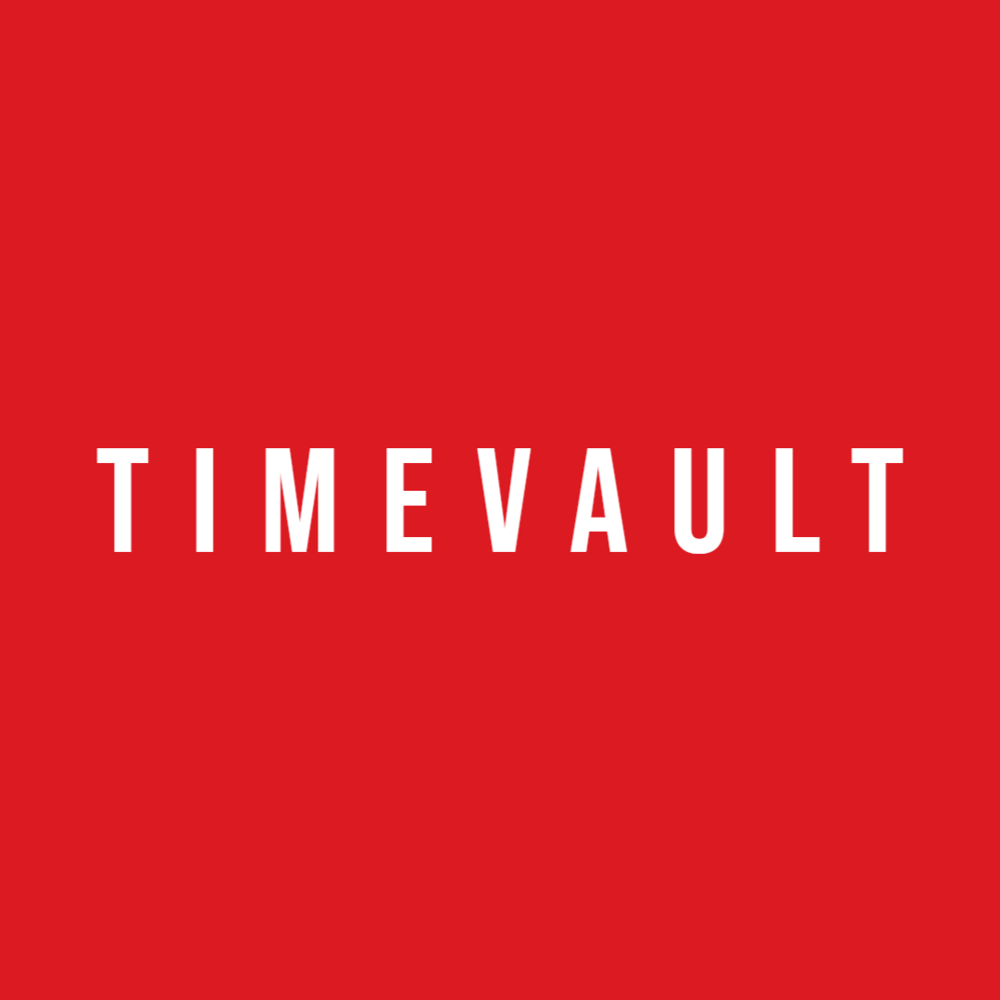

<h3 align="center">

[![Download][download-shield]][download-url]
[![Release][release-shield]][release-url]
[![Issues][issues-shield]][issues-url]
[![License][license-shield]][license-url]
</h3>

<!-- PROJECT LOGO -->
<br />
<p align="center">
  <a href="https://github.com/phamngocvinh/timevault">
    
  </a>

  <h3 align="center">TimeVault</h3>

  <p align="center">
    :date: Schedule file backup service
    <br />
    <a href="https://github.com/phamngocvinh/timevault"><strong>Explore the docs »</strong></a>
    <br />
    <br />
    <a href="https://github.com/phamngocvinh/timevault/wiki/Usage-Example">View Demo</a>
    ·
    <a href="https://github.com/phamngocvinh/timevault/issues">Report Bug</a>
    ·
    <a href="https://github.com/phamngocvinh/timevault/issues">Request Feature</a>
  </p>
</p>

<!-- TABLE OF CONTENTS -->
<details open="open">
  <summary><h2 style="display: inline-block">Table of Contents</h2></summary>
  <ol>
    <li>
      <a href="#stars-about-the-project">About The Project</a>
    </li>
    <li>
      <a href="#beginner-how-to-build">How to Build</a>
    </li>
    <li><a href="#man_teacher-usage">Usage</a></li>
    <li><a href="#world_map-roadmap">Roadmap</a></li>
    <li><a href="#rocket-contributing">Contributing</a></li>
    <li><a href="#closed_book-license">License</a></li>
    <li><a href="#mailbox-contact">Contact</a></li>
    <li><a href="#books-acknowledgements">Acknowledgements</a></li>
  </ol>
</details>

<!-- ABOUT THE PROJECT -->
## :stars: About The Project

COMING SOON

<!-- HOW TO BUILD -->
## :beginner: How to Build

To get a local copy up and running, follow these simple steps.

1. Clone the repo
   ```sh
   git clone https://github.com/phamngocvinh/timevault.git
   ```
2. Install requirements
   ```sh
   pip install -r requirements.txt
   ```
3. Run `build` script
4. Executable file will be generated in `dist` folder

<!-- USAGE -->
## :man_teacher: Usage
COMING SOON

_For more examples, please refer to the [Documentation](https://github.com/phamngocvinh/timevault/wiki)_

<!-- ROADMAP -->
## :world_map: Roadmap

See the [open issues](https://github.com/phamngocvinh/timevault/issues) for a list of proposed features (and known issues).

<!-- CONTRIBUTING -->
## :rocket: Contributing

Contributions are what make the open source community such an amazing place to learn, inspire, and create. Any contributions you make are **greatly appreciated**.

1. Fork the Project
2. Create your Feature Branch (`git checkout -b feature/AmazingFeature`)
3. Commit your Changes (`git commit -m 'Add some AmazingFeature'`)
4. Push to the Branch (`git push origin feature/AmazingFeature`)
5. Open a Pull Request

<!-- LICENSE -->
## :closed_book: License

Distributed under the GPL-3.0 License. See `LICENSE` for more information.

<!-- CONTACT -->
## :mailbox: Contact

[![Mail][mail-shield]][mail-url]
[![LinkedIn][linkedin-shield]][linkedin-url]

<!-- ACKNOWLEDGEMENTS -->
## :books: Acknowledgements

* [Python Software Foundation](https://www.python.org/)
* [PyInstaller](https://pyinstaller.readthedocs.io/en/stable/)
* [Shields.io](https://shields.io)

<!-- MARKDOWN LINKS & IMAGES -->
<!-- https://www.markdownguide.org/basic-syntax/#reference-style-links -->
[download-shield]: https://img.shields.io/github/downloads/phamngocvinh/timevault/total?style=for-the-badge&labelColor=4c566a&color=5e81ac&logo=github&logoColor=white
[download-url]: https://github.com/phamngocvinh/timevault/releases/latest
[release-shield]: https://img.shields.io/github/v/release/phamngocvinh/timevault?style=for-the-badge&labelColor=4c566a&color=5e81ac&logo=Battle.net&logoColor=white
[release-url]: https://github.com/phamngocvinh/timevault/releases/latest
[issues-shield]: https://img.shields.io/github/issues/phamngocvinh/timevault?style=for-the-badge&labelColor=4c566a&color=5e81ac&logo=Todoist&logoColor=white
[issues-url]: https://github.com/phamngocvinh/timevault/issues
[license-shield]: https://img.shields.io/github/license/phamngocvinh/timevault?style=for-the-badge&labelColor=4c566a&color=5e81ac&logo=AdGuard&logoColor=white
[license-url]: https://github.com/phamngocvinh/timevault/blob/master/LICENSE
[linkedin-shield]: https://img.shields.io/badge/linkedin-blue?style=for-the-badge&logo=linkedin
[linkedin-url]: https://www.linkedin.com/in/phamngocvinh932
[mail-shield]: https://img.shields.io/badge/Gmail-white?style=for-the-badge&logo=gmail
[mail-url]: mailto:phamngocvinh@live.com
[product-screenshot]: images/screenshot.jpg
